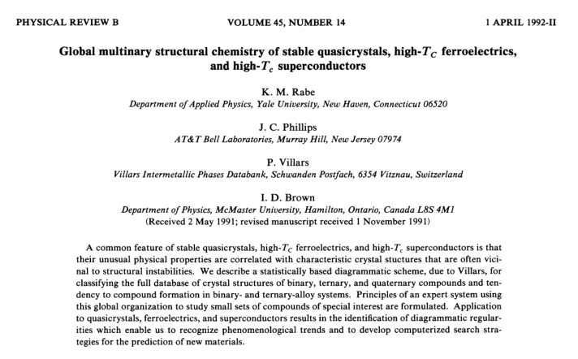

This purpose of this article is to explore the superconductor database and build models to predict whether superconducting Transition temperature Tc is high or low from three "golden coordinates" given by Rabe, Villars, Philips and Brown: 

- **dX**: metallic electronegativity  
- **dR**: orbital radii difference  
- **Nv**: average valence electron number 

The detailed definition of these features is from this article: [article](http://journals.aps.org/prb/abstract/10.1103/PhysRevB.45.7650)



The work is done with collobaration of:

- Gilad Kusne, Research Scientist, National Institute of Science and Technology
- Ichiro  Takeuchi, Professor of Materials Science and Technology in University of Maryland.

## Outline
1. Importing, Cleaning and Saving Data

2. Visualization and Prelimarary exploration

3. High Tc Predictions With Different Models

4. Sweet spots reidentification

5. summary


## Importing, Cleaning and Saving Data
```{r,CACHE = T, message=FALSE}
library("R.matlab")
# read raw matlab file
a <- readMat("data/SCDB.mat")
# build data frame
name <-as.character()
SCDB <-data.frame(dX=a$dX,Nv=a$Nv,dR=a$dR,Tc=a$Tc)
#extract names
for (i in 1:nrow(SCDB)){
  value <- (a$grouped.str)[[i]][[1]][1,1]
 name[i] <- ifelse(is.null(value), NA,value)
}
SCDB <-cbind(name=name,SCDB)
#remove NAs
na <-sum(is.na(SCDB))
totalnum <- nrow(SCDB)
SCDB <- SCDB[!(is.na(SCDB$name)) & !(is.na(SCDB$dX)),]
#save as txt file
write.table(SCDB, "data/neatdata.txt", sep="\t")
```

There are `r na` NAs from a total number of `r totalnum` entries. We decide to remove them for our analysis. The data is saved in data/neatdata.txt.

## Data Exploration
The histogram of the features and Tc are in the following:
```{r,echo= FALSE,message=FALSE}
par(mfrow=c(2,2))
hist(SCDB$Tc,breaks=200)
hist(SCDB$dR,breaks=200)
hist(SCDB$dX,breaks=200)
hist(SCDB$Nv,breaks=200)
dev.copy(png,'figures/histogram.png')
dev.off()
par(mfrow=c(1,1))
```  

We noticed that all three feature ranges are similar(between -10 to 10). So we will skip the feature normalization before future analysis. Also notice that there are some peaks in the histogram data.

Feature ranges and pair plot of the features:
```{r,echo= FALSE,message=FALSE}
str(SCDB)
pairs(SCDB)
dev.copy(png,'figures/pairs.png')
dev.off()
par(mfrow=c(1,1))
```  


## Model Building

First, a simple linear model is used to predict Tc:
```{r, message=FALSE}
library(caret)
model_lm <- train(Tc ~dX+Nv+dR, data=SCDB,method="lm")
finMod <-model_lm$finalModel
print(finMod)
rmse <- sqrt(mean((finMod$fitted.values-SCDB$Tc)^2))

```

The rmse is as large as `r rmse` K. This means the relationship between Tc and the features are highly nonlinear.

```{r}
m<- median(SCDB$Tc)
SCDB$label <-as.factor(ifelse(SCDB$Tc>m,"high","low"))
```
The median of the Tc is `r m`K. We split these superconductors into two parts with the same number: high Tc ones with label "high' and low Tc with label  "low".

Next we will use three models to predict the labels in SCDB: generalized linear model(glm), decision tree and k-nearest neighbours. We will use 10-fold cross validation for all the models we use below. Since the prediction label is perfectly balanced, we will use the prediction precision to compare models.

### Generalized Linear Modeling (glm)

First we will use Generalized Linear Modeling as our model.
```{r, message=FALSE}
train_control <- trainControl(method="cv", number=10)
model_glm <- train(label~dX+Nv+dR,data=SCDB,trControl=train_control, method="glm",tuneLength = 9)
pred_glm<- predict(model_glm , SCDB)
Pglm <- postResample(pred_glm, SCDB$label)[1]
```
The accuracy of the glm is `r Pglm`.

### Decision Tree

Second we will use decision tree as our model. 
```{r, message=F}
train_control <- trainControl(method="cv", number=10)
model_tree <- train(label~dX+Nv+dR,data=SCDB,trControl=train_control, method="rpart",tuneLength = 9)
pred_tree<- predict(model_tree , SCDB)
Ptree <- postResample(pred_tree, SCDB$label)[1]
```
The accuracy of the decision tree modeling is `r Ptree`.

This is how our decision tree looks like:
```{r, echo = FALSE, message=FALSE}
library(rattle)
fancyRpartPlot(model_tree$finalModel)
dev.copy(png,'figures/tree.png')
dev.off()
par(mfrow=c(1,1))
```
The decision tree uses dX as the first decision. This can be confirmed by the hisogram plot of dX labeled with high Tc or low Tc.
```{r,echo=F}
par(mfrow=c(1,1))
hist(SCDB$dX[SCDB$label=="high"],breaks=200,col="red",xlab="dX",main="Histogram of dX")
hist(SCDB$dX[SCDB$label=="low"],breaks=200,add=TRUE,col="blue")
text(1,1200,"Red: Tc > 19K",col="red")
text(1,1000,"Blue: Tc < 19K",col="blue")
dev.copy(png,'figures/dX.png')
dev.off()
par(mfrow=c(1,1))

```

### k-nearest neighbours modeling
Finally, knn is used:
```{r, message=F}
modelknn <- train(label~dX+Nv+dR, data=SCDB,method="knn",trControl=train_control,tuneLength = 9)
predknn <- predict(modelknn , SCDB)
Pknn <- postResample(predknn, SCDB$label)[1]
```

The accuracy of the knn modeling is `r Pknn`. n = 5 is used in the final model. Recall that our glm precision is `r Pglm` and decision tree precision is `r Ptree`. Thus the best model in our prediction task is knn.


## Sweet spots reidentification
In the original article, the authors' identified three regions in the feature space where it is more likely to find high Tc materials. Are these regions still the sweet spots after almost 30 years of discovery of new materials? Let us find it out.


The three rectangles A, B and C are the replicates from the original paper.Red dots indicates high Tc regions.
```{r,cache=TRUE, echo=F}
library(ggplot2)
plot(SCDB$dX, SCDB$dR,col= ifelse(SCDB$label=="high","red","black"), main="Quantum Structural Diagram", pch =16)
     
rect(-0.5,-0.9,0.2,0.1,col="green",density=0,lwd=2)
text(0,-0.5,"A",col="green",lwd=3)

rect(-1.2,1.9,-0.1,2.6,col="blue",density=0,lwd=2)
text(-0.5,3,"B",col="blue",lwd=3)


rect(-2.4,1.2,-0.3,1.65,col="red",density=0,lwd=2)
text(-2,0,"C:high Tc?",col="red",lwd=3)
abline(h=0)
abline(v=0)
dev.copy(png,'figures/diagram.png')
dev.off()
```

Bases on the this figure, it seems these three regions are not the sweet regions anymore. There might be some new regions emerging according to this figure.

## Summary
Based on our analysis above, we drew the following conclusion from the data:

- k-nearest neighbours(KNN) with k = 5 gives the best model prediction on the high Tc superconductors.

- The three sweet regins discovered in 80s are no longer "sweet".

- dX, the ionic displacement, is the most important variable in determining high Tc properties.

If you have furthur questions or comments, please email: jieyong0731@gmail.com.